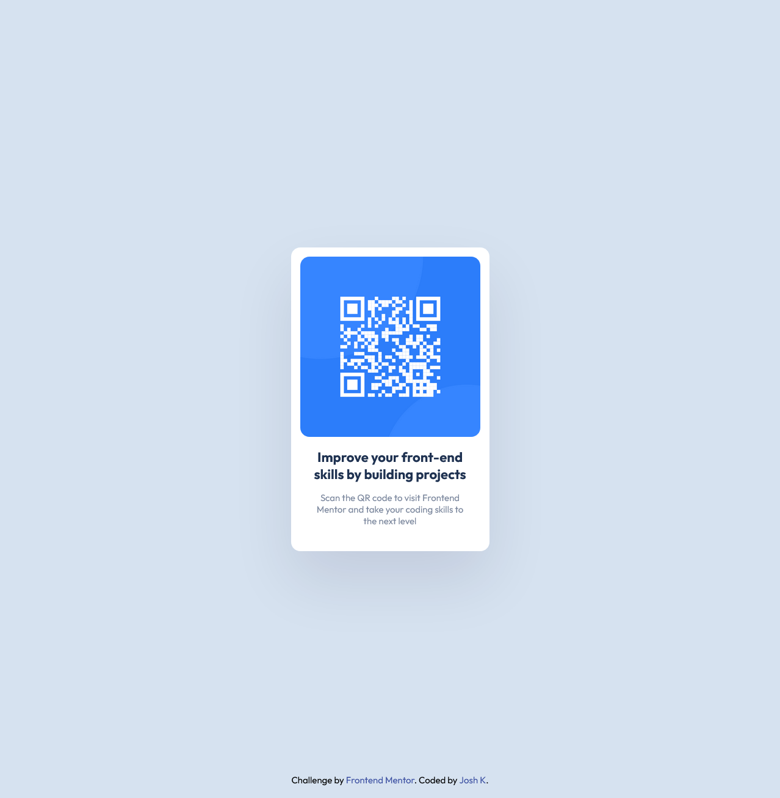

# Frontend Mentor - QR code component solution

This is a solution to the [QR code component challenge on Frontend Mentor](https://www.frontendmentor.io/challenges/qr-code-component-iux_sIO_H). Frontend Mentor challenges help you improve your coding skills by building realistic projects. 

## Table of contents

- [Overview](#overview)
  - [Screenshot](#screenshot)
  - [Links](#links)
- [My process](#my-process)
  - [Built with](#built-with)
  - [What I learned](#what-i-learned)
  - [Continued development](#continued-development)
  - [Useful resources](#useful-resources)
- [Author](#author)
- [Acknowledgments](#acknowledgments)

**Note: Delete this note and update the table of contents based on what sections you keep.**

## Overview

### Screenshot

### Links

- Solution URL: [https://github.com/jkaps9/qr-code-component-main](https://github.com/jkaps9/qr-code-component-main)
- Live Site URL: [https://jkaps9.github.io/qr-code-component-main/](https://jkaps9.github.io/qr-code-component-main/)

## My process

### Built with

- Flexbox

### What I learned

How to center a "card" with Flexbox on the screen

### Continued development

Need to improve on making the sizing more dynamic. Currently have a media query which I think generally works, but could be more dynamic.  

### Useful resources

Brad Traversy's YouTube series

## Author

- Frontend Mentor - [@jkaps9](https://www.frontendmentor.io/profile/jkaps9)

## Acknowledgments

Brad Traversy's YouTube series
